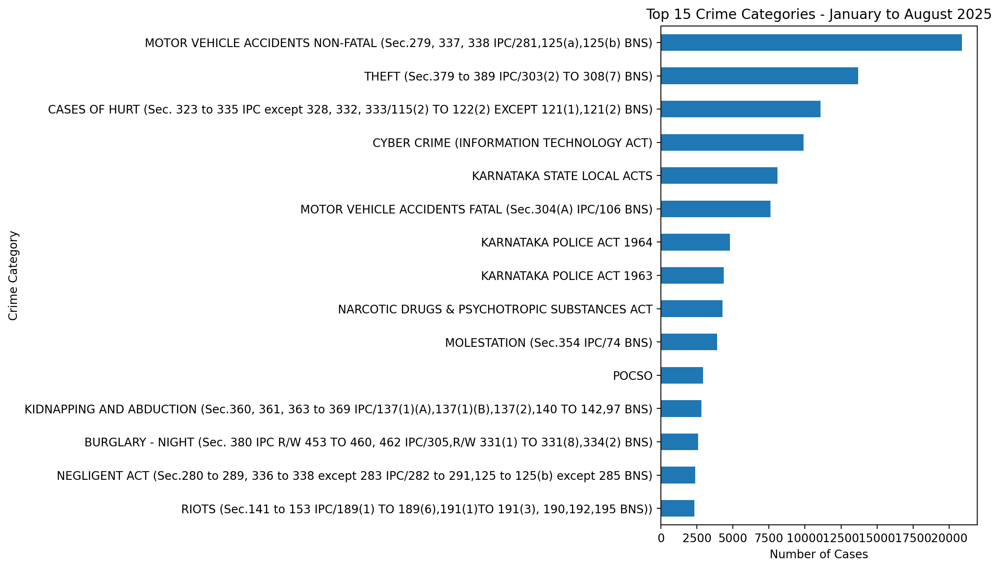
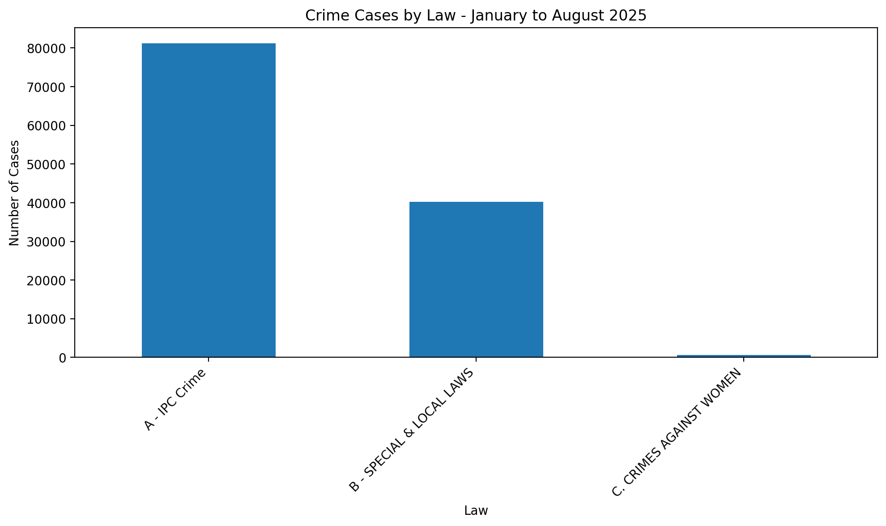
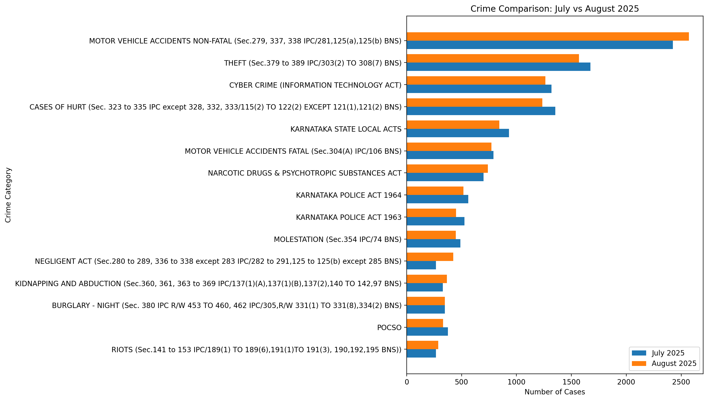
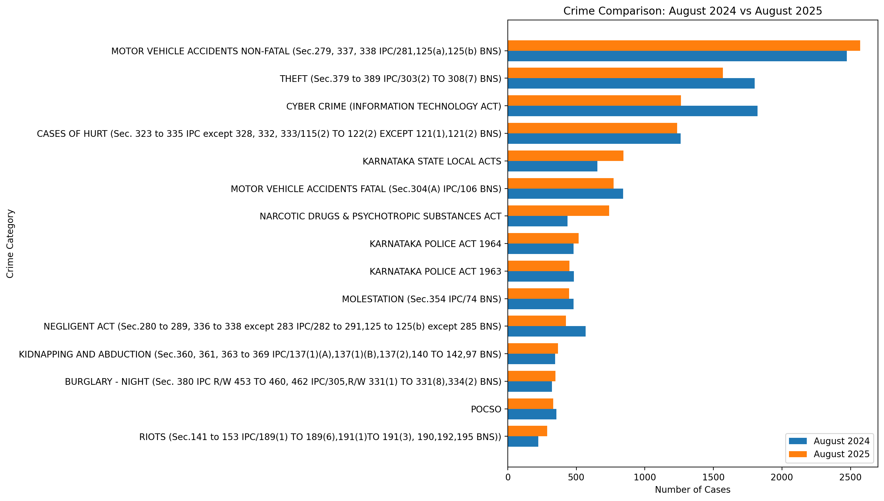
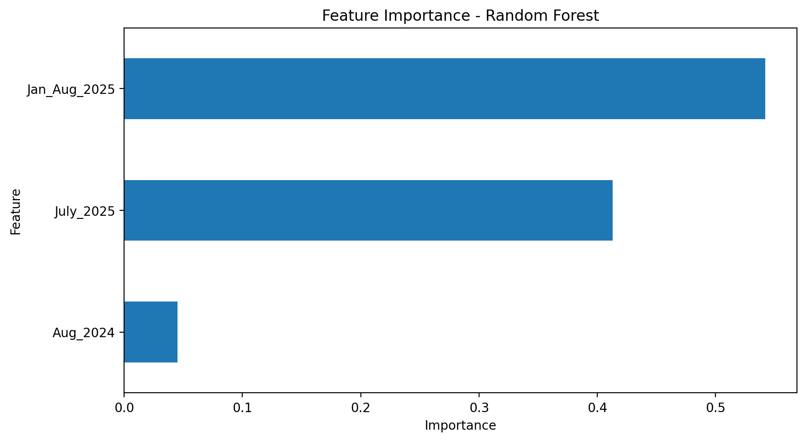
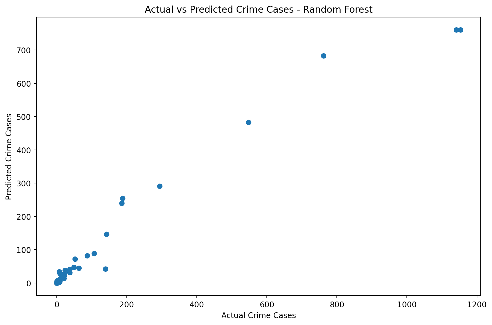
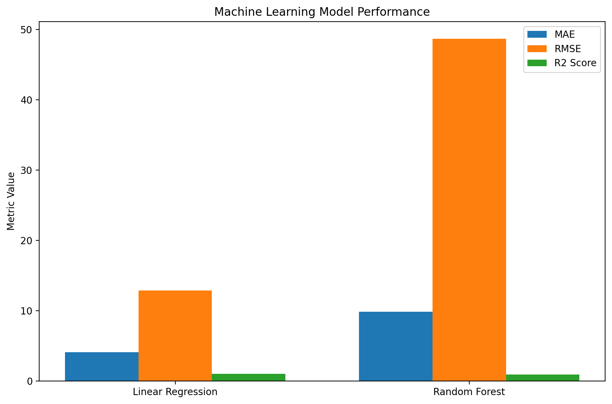

powershell -NoProfile -Command "$content = @'
# Indian Crime Trends and Predictive Analytics

## Project Overview

This project analyzes Indian crime data from January to August 2025 and uses predictive analytics to estimate August 2025 crime case counts from historical and recent crime indicators.

The project combines data cleaning, exploratory data analysis, visualization, percentage-change analysis, and machine learning regression models.

## Dataset

The dataset contains 689 records and 7 columns.

The main fields are:

- Law under which they are registered
- Crime and Legal Section
- Reason
- Number of cases from January to August 2025
- Number of cases in August 2024
- Number of cases in July 2025
- Number of cases in August 2025

The dataset contains 3 law groups, 107 crime categories, and 541 unique crime reasons.

## Data Cleaning

The following data-quality checks were performed:

- Dataset dimensions were inspected.
- Column names and data types were examined.
- Statistical summaries were generated.
- Missing values were checked.
- Duplicate records were checked.
- A cleaned DataFrame was created.
- Columns were renamed for easier analysis.

The dataset contained no missing values and no duplicate rows.

## Exploratory Data Analysis

The analysis includes:

- Distribution of crime categories
- Analysis of crime reasons
- Law-wise crime analysis
- Top crime categories from January to August 2025
- July 2025 versus August 2025 comparison
- August 2024 versus August 2025 comparison
- Percentage change analysis
- Identification of crimes with the highest increases
- Identification of crimes with the largest decreases

### Key Observations

Cyber Crime under the Information Technology Act appears repeatedly among the categories with the largest percentage increases between August 2024 and August 2025.

Some crime categories recorded a 100 percent decrease where the August 2024 value was greater than zero and the August 2025 value became zero.

The project also highlights that percentage changes can become very large when the previous-year case count is small.

## Predictive Analytics

The target variable is:

`Aug_2025`

The following features were used:

- `Jan_Aug_2025`
- `Aug_2024`
- `July_2025`

The dataset was divided into:

- Training data: 551 rows
- Testing data: 138 rows

A train-test split of 80 percent training data and 20 percent testing data was used.

## Machine Learning Models

Two regression models were evaluated:

1. Linear Regression
2. Random Forest Regressor

### Model Performance

| Model | MAE | RMSE | R2 Score |
|---|---:|---:|---:|
| Linear Regression | 2.150055 | 6.138934 | 0.984600 |
| Random Forest | 1.888074 | 5.432520 | 0.987941 |

Based on the evaluation metrics, Random Forest performed better than Linear Regression on the test data.

## Feature Importance

The Random Forest model identified the following feature importance values:

| Feature | Importance |
|---|---:|
| July 2025 | 0.619799 |
| January to August 2025 | 0.305318 |
| August 2024 | 0.074884 |

July 2025 was the most important feature in the Random Forest model.

## Technologies Used

- Python
- Pandas
- NumPy
- Matplotlib
- Seaborn
- Scikit-learn
- Google Colab
- Git
- GitHub

## Project Structure

```text
Indian-Crime-Trends-Predictive-Analytics
|
|-- Data
|   `-- indian-crimes-from-jan-to-aug-2025.csv
|
|-- notebooks
|   `-- Indian_Crime_Trends_Predictive_Analytics.ipynb
|
|-- visualizations
|
|-- README.md
|-- requirements.txt
`-- .gitignore

## Project Visualizations

### Top 15 Crime Categories


### Crime Cases by Law


### July vs August 2025


### August 2024 vs August 2025


### Random Forest Feature Importance


### Actual vs Predicted


### Model Performance Comparison


